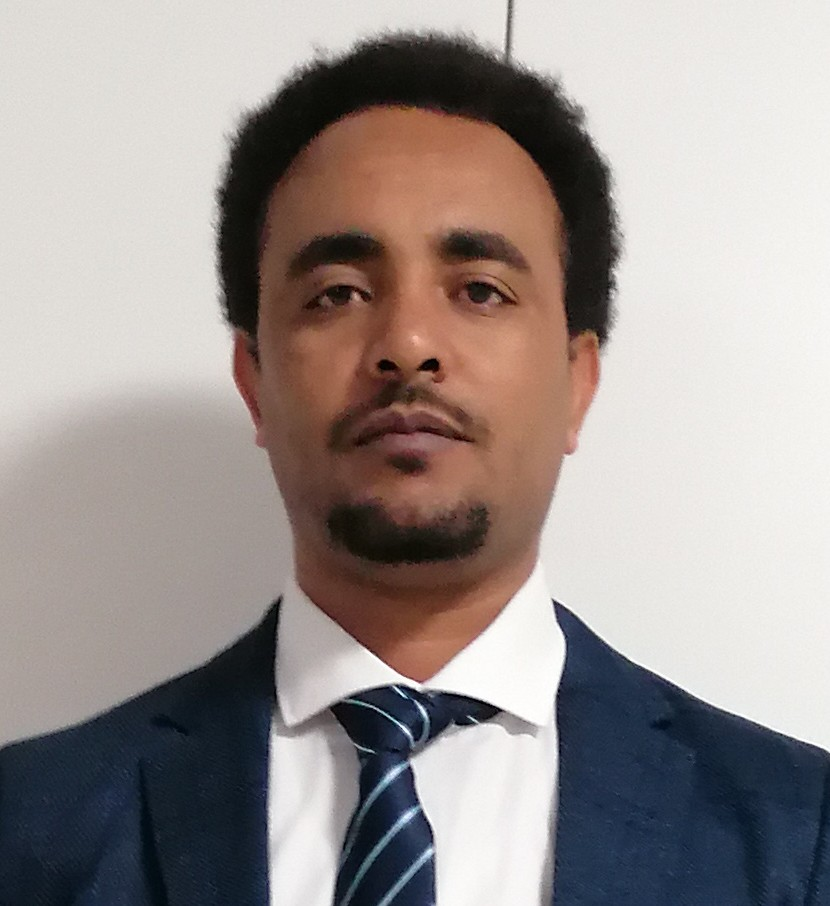

# Tesfay

---

## About me

Hello everyone 👋! My origin is from Ethiopia. I came to Belgium in 2019. By
profession i am **Biotechnologist** with teaching in higher education and
research experience. I have more than 8 years of teaching experience in Ethiopia
and elaborated my research experience at KU Leuven, Belgium. I have deep
interest and passion IT in particular **web development** based applications.
**HackYourFuture Belgium** gave me this golden opportunity to be trained in
**fullstack development**. This will help me to take my skills to the next
level. I am pleased to discuss with you and discuss and contact information is
presented below.

---

### Work Experience

- Doctoral research student:KU Leuven, Leuven, Belgium 09/2019 – 08/2022

- Full time Lecturer : Applied Biology, ASTU, Adama, Ethiopia 09/2008– 08/2019

---

### Education History

- **Master of Biotechnology (MBT)** (Medical Biotechnology): Wageningen
  University, The Netherlands. 2012 – 2014

- **Bachelor of Sciences (BSc.) in Applied Biology**: University of Gondar,
  Ethiopia. 2005 – 2008

---

### Training and Certificates

- Emerging Technologies:IBM

- Web Development Fundamentals: IBM

- Data Fundamentals: IBM

## Contact information

- **LinkedIn**: linkedin.com/in/haftu-abraha-tesfay

- **E-mail:** <tesfay.haftu1989@gmail.com>

- **phone:** +32483331013
